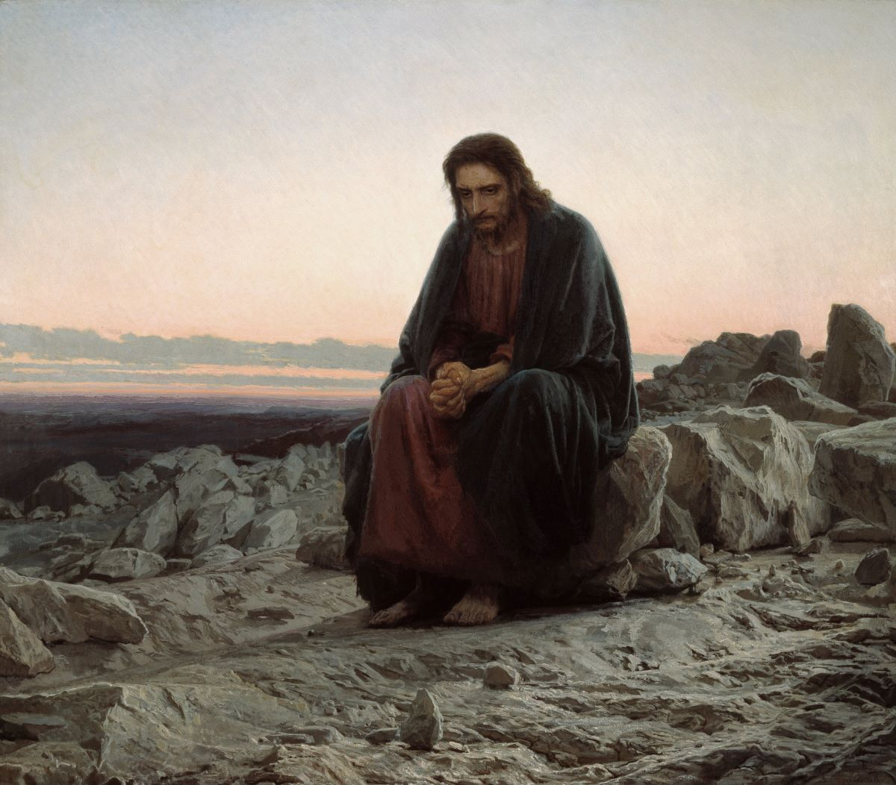

# Christlike attributes and warning signs

This page is what I will use to finish the portfolio. I keep coming back to Matthew 4 because it is the clearest picture I have of the kind of king I am supposed to follow, and because it names the same temptations that show up in technical work if I am not paying attention.

## The wilderness

After His baptism, Satan meets Christ in the wilderness and tries Him three times, in three different places, with three different offers.

The first is food after forty days of fasting. Christ answers that man shall not live by bread alone. That does not mean food is optional. It means survival is not the whole assignment. A person also has to feed on the word of God and on doing the Father’s will or the inside of them stays empty. Israel learned that the hard way. They were given manna in the desert after Egypt and still said they had been abandoned while He was feeding them.

The second is the high point of the temple in Jerusalem. Satan tells Him to throw Himself down so the angels will catch Him, and everyone will have proof that the Father loves Him. Christ answers that you do not put the Lord your God to the test. If I put myself in foolish, avoidable danger to force a reaction out of someone I love, I am not showing faith. I am demanding evidence. That is true with God, and it is true between people. Israel did this constantly. They wanted another sign instead of trusting the One who was already with them.

The third is a high place and all the kingdoms as far as the eye can see, offered in exchange for a bow. Christ tells him to be gone. He does not refuse to be King, leader, and priest. He refuses a throne that is purchased by worshiping evil. There is nothing we can hand Him that He cannot already do. What He will not do is take our agency away and rule us like slaves. That is the opposite of Herod. A historian from that period said it was safer to be Herod’s pig than his son, which is what power looks like when it has no covenant on it.

## The Grand Inquisitor

In *The Brothers Karamazov*, Ivan Karamazov tells his brother Alyosha a story that turns those three answers inside out. Ivan is brilliant and angry at human suffering. Alyosha is training to be a monk. In Ivan’s parable, Christ comes back to earth and the Grand Inquisitor arrests Him. The Inquisitor says people are too weak for the freedom Christ gave them. They need bread first, then obedience that makes them dependent. They need miracles because they cannot believe without a show. They need an authority that removes the anxiety of choosing. The church, the Inquisitor says, has given them that, and that is why Christ has to be locked up. The scene ends with Christ kissing him after He is told that He would be executed tomorrow. The Inquisitor opens the cell door and leaves without a word, which puts the choice back where it belongs.

## What this has to do with an IT degree

This program and this job are full of the same three pitches, just wearing different clothes. Some people are extremely sharp and use that sharpness to make other people feel small. Some do not care whether the work helps or harms as long as the paycheck lands. Some have enough skill to take what they want, and they treat that as a right. None of that is unique to technology. People bring a spirit into whatever tool they pick up. Artificial intelligence is only the latest version of the same problem, which is a powerful thing in public hands, used according to whatever is already driving the person who holds it. It can bless and it can wreck. Wisdom and love are not optional extras if we want the first of those two.

What I am trying to refuse is the same set of offers. I do not want to live by bread alone in this field, which for me would mean speed, status, and a paycheck with no regard for the person on the other end of the ticket. I do not want to throw a customer’s machine off the temple to see if I am clever enough to catch the malware in midair. I do not want the kingdoms, like access, data, a noisy detection rule, a hunt across someone else’s tenant, if the cost is a quiet bow to “I can, so I should.” Heavenly Father’s will comes first. Christ said that in Gethsemane. That is the sentence I need when the outcome I want starts talking louder than the people I am supposed to protect.

The attributes I am trying to keep in the work are honesty, humility, charity, diligence, and respect for agency. Honesty means I write what the evidence shows, and I do not decide the user is foolish so the story is easier. Humility means I admit when I do not know and I ask instead of improvising on someone else’s life. Charity means I treat the person who clicked with grace, because I have been the one who needed grace. Diligence means I keep sharpening the skill instead of coasting on a certificate. Agency means I defend other people’s data and choices. I am not the Inquisitor. I do not get to decide they are too weak to be told the truth or too careless to be protected.

## Warning signs

I know I am drifting when the ticket becomes bread only. I finish it fast, look competent, collect the hours. I know I am drifting when curiosity wants the live device left up so I can watch command-and-control a little longer. That is akin to the temple jump. I know I am drifting when a tool is in my hands and the thought is “just look” or “whatever, just run it” because I can. I know I am drifting when I talk in a way that makes a coworker or a customer feel stupid for not knowing what I know. The transformation and drift starts as a feeling that only I can feel a correct within my own heart.

## Realignment

When I notice myself drifting, the version of “be gone” is specific for me. Isolate. Ask for help from my supervisor or coworker. Open the playbook instead of inventing a path. Put the keylog down if I have already seen enough to say the data is sensitive. Open Matthew 4 and remember which king I said I follow. Least privilege is not only a security control but it is how I refuse the kingdoms that were never mine.

## References

Dostoyevsky, F. (2002). *The brothers Karamazov* (R. Pevear & L. Volokhonsky, Trans.). Farrar, Straus and Giroux. (Original work published 1880)

The Church of Jesus Christ of Latter-day Saints. (2013). Matthew 4. In *The Holy Bible*. https://www.churchofjesuschrist.org/study/scriptures/nt/matt/4

*Ivan Kramskoy, Christ in the Wilderness, 1872. Public domain.*
