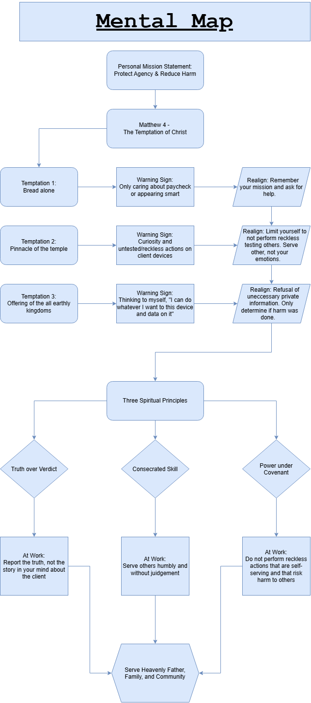

# Mental map

This is my mental map for Week 5. 

My personal mission statement is at the top. Matthew 4 describes Christ's temptations in the wilderness. 

I related each temptation to a warning sign at work and life and then connected them to a realignment strategy that has help me stay on the right path. 

Those strategies build and feed into the three spiritual principles described in this portfolio. 

They feed into my mindset at work when I use these new skills gained from this program to serve others righteously.

This is the visual representation of how I have intertwined my spiritual discipleship and technical skills into one mindset. 

This mindset is the path to fulfill my mission, "Protect agency and reduce harm."  

Without this I would be lost in worldly temptations without finding the Heavenly blessings in this mortal life. 
